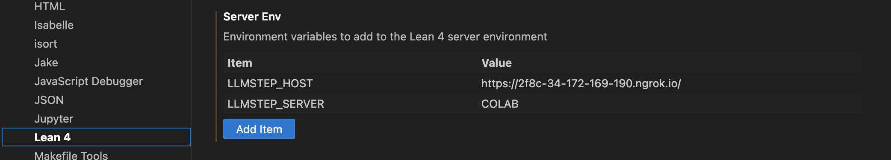
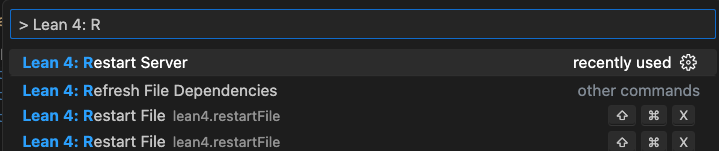

# `llmstep`: [L]LM proofstep suggestions in Lean
*News*
- [11.2023] Experimental support for [*Llemma*](https://arxiv.org/abs/2310.10631) suggestions that leverage the document's content
- [10.2023] New paper describing version 1.0.0 of `llmstep`: [[paper](https://arxiv.org/abs/2310.18457)]
- [10.2023] `llmstep` adds direct support for reprover (`leandojo-lean4-tacgen-byt5-small`)
- [9.2023] `llmstep` adds support for free GPU servers via Google Colab


---

`llmstep` is a Lean 4 tactic for suggesting proof steps using a language model:


Calling `llmstep "prefix"` gives suggestions that start with `prefix`:
```lean
example (f : ℕ → ℕ) : Monotone f → ∀ n, f n ≤ f (n + 1) := by
  intro h n
  llmstep "exact"

==> Lean Infoview
  Try This:
    * exact h (Nat.le_succ _)
    * exact h (Nat.le_succ n)
    * exact h (Nat.le_add_right _ _)
```

Clicking a suggestion places it in the proof:
```lean
example (f : ℕ → ℕ) : Monotone f → ∀ n, f n ≤ f (n + 1) := by
  intro h n
  exact h (Nat.le_succ _) -- llmstep "exact"
```

`llmstep` checks the language model suggestions in Lean, and highlights those that are valid and/or close the proof.


## Using `llmstep` in a project
1. Add `llmstep` in `lakefile.lean`:
```lean
require llmstep from git
  "https://github.com/wellecks/llmstep"
```
Then run `lake update`.

2. Import `llmstep` in a Lean file:
```lean
import LLMstep
```

3. Start a server based on your runtime environment. For instance:
```bash
python python/server.py
```
Please see the recommended servers below.

## Servers
The `llmstep` tactic communicates with a server that you can run in your own environment (e.g., CPU, GPU, Google Colab). \
The table below shows the recommended language model and server commands:

| Environment  | Command | Default Model | Context |Speed | miniF2F-test |
| -------- | ------- | ------- |-------|------- |------- |
| CPU  | `python python/server_encdec.py` | [LeanDojo ByT5 300m](https://huggingface.co/kaiyuy/leandojo-lean4-tacgen-byt5-small) | State | 3.16s | 22.1\%|
| Colab GPU  | See [Colab setup](#google-colab)  | [llmstep Pythia 2.8b](https://huggingface.co/wellecks/llmstep-mathlib4-pythia2.8b) |State |1.68s | 27.9\%|
| CUDA GPU | `python python/server_vllm.py` | [llmstep Pythia 2.8b](https://huggingface.co/wellecks/llmstep-mathlib4-pythia2.8b) |State|**0.25s** | **27.9\%**|
| CUDA GPU* | `python python/server_llemma.py` | [Llemma 7b](https://huggingface.co/EleutherAI/llemma_7b) |State, **current file**  🔥  | N/A | N/A|

Please refer to [our paper](https://arxiv.org/abs/2310.18457) for further information on the benchmarks.

If your GPU does not support [vLLM](https://vllm.readthedocs.io/en/latest/), please use `python python/server.py` to start a server.

`llmstep` aims to be a model-agnostic tool. We welcome contributions of new models.


\* File context support (e.g. with [Llemma](https://arxiv.org/abs/2310.10631)) is currently experimental.


## Implementation


`llmstep` has three parts:
1. a [Lean tactic](./LLMstep/LLMstep.lean)
2. a [language model](https://huggingface.co/wellecks/llmstep-mathlib4-pythia2.8b)
3. a [Python server](./python/server.py)

The Lean tactic calls a [Python script](./python/suggest.py), which sends a request to the server. \
The server calls the language model and returns the generated suggestions. \
The suggestions are displayed by the tactic in VS Code.


## Google Colab

To use Google Colab's free GPU to run a server, follow these instructions:

1. Open and run this notebook to start a server: [](https://colab.research.google.com/github/wellecks/llmstep/blob/master/python/colab/llmstep_colab_server.ipynb)

2. In your local environment, set the environment variable `LLMSTEP_HOST` equal to the url printed out in this notebook (for example, `https://04fa-34-125-110-83.ngrok.io/`).

3. In your local environment, set the environment variable `LLMSTEP_SERVER=COLAB`.

4. Use `llmstep`.

#### VS Code steps (2) and (3)

To set environment variables in VS Code, go to:

- Settings (`Command` + `,` on Mac)
- Extensions -> Lean 4
- Add the environment variables to `Server Env`. For example:


- Then restart the Lean Server (`Command` + `t`, then type `> Lean 4: Restart Server`):



## Language model
By default, `llmstep` uses a Pythia 2.8b language model fine-tuned on [LeanDojo Benchmark 4](https://zenodo.org/record/8040110):
- [`llmstep` model on Huggingface](https://huggingface.co/wellecks/llmstep-mathlib4-pythia2.8b)


The [python/train](python/train) directory shows how the model was fine-tuned.

#### Reprover
You can use the non-retrieval version of [Reprover](https://github.com/lean-dojo/ReProver), which we refer to as [LeanDojo ByT5 300m](https://huggingface.co/kaiyuy/leandojo-lean4-tacgen-byt5-small):

```
python python/server_encdec.py
```
By default, this runs the `leandojo-lean4-tacgen-byt5-small` model.\
This model is particularly useful on CPU due to its small parameter count.

#### Fine-tuning your own model
The scripts in [python/train](python/train) show how to finetune a model.

#### Using a different model

Swap in other decoder-only language models with the `--hf-model` argument:
```bash
python server.py --hf-model some/other-model-7B
```
Use `--hf-model` with `python/server_encdec.py` for encoder-decoder models.

Use `--hf-model` with `python/server_llemma.py` for prompted base models (e.g. CodeLlama).


## Additional Notes

#### Acknowledgements
* The `llmstep` tactic is inspired by [`gpt-f`](https://github.com/jesse-michael-han/lean-gptf).
* Fine-tuning data for the Pythia-2.8b model is from  [LeanDojo](https://leandojo.org/).
* The fine-tuning code is based on the script from [Stanford Alpaca](https://github.com/tatsu-lab/stanford_alpaca).
* The tactic implementation adopts ideas and code from Mathlib4's `Polyrith` and `Std.Tactic.TryThis`.
* Thank you to Mario Carneiro and Scott Morrison for reviewing the tactic implementation.

#### History
`llmstep` was initially created for an IJCAI-2023 tutorial on neural theorem proving.\
It aims to be a model-agnostic platform for integrating language models and Lean.

#### Citation

Please cite:
```
@article{welleck2023llmstep,
    title={LLMSTEP: LLM proofstep suggestions in Lean},
    author={Sean Welleck and Rahul Saha},
    journal={arXiv preprint arXiv:2310.18457},
    year={2023}
}
```
